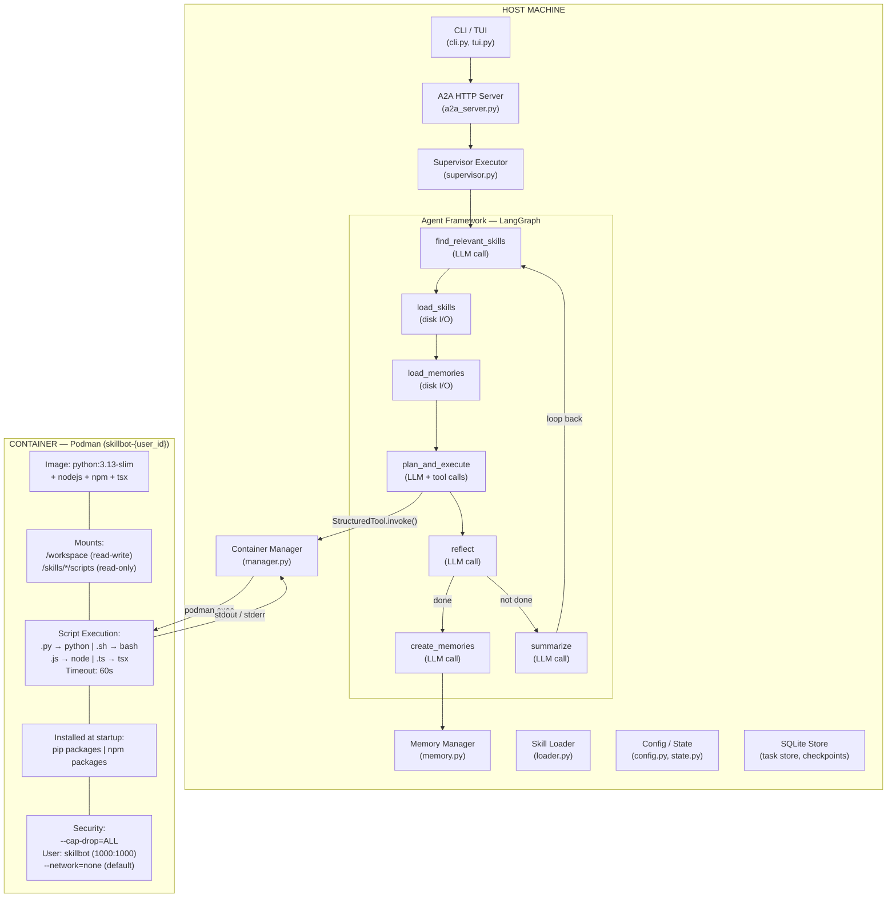
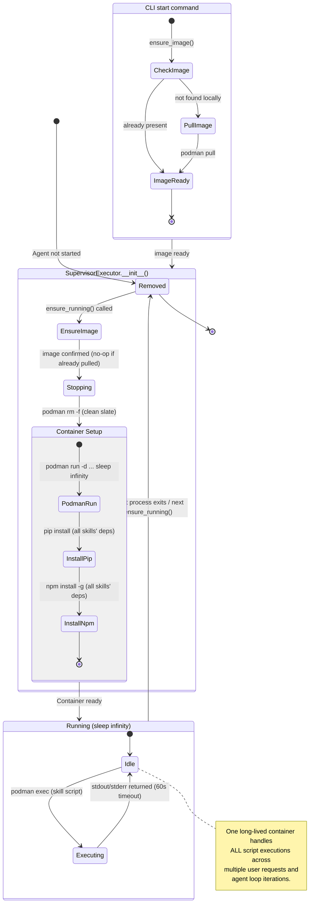
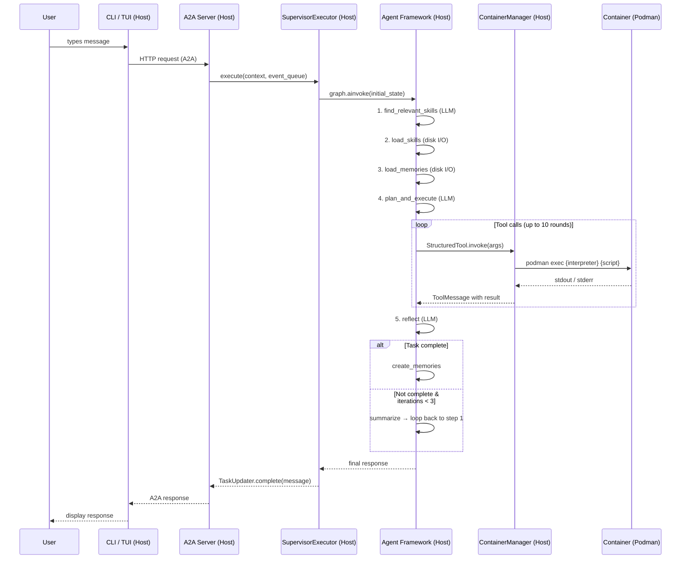

# Architecture: Host vs Container Execution

## High-Level Overview

## Container Lifecycle

A **single container** is created per user and reused for the entire agent lifecycle. Scripts are never executed by spawning new containers — instead, `podman exec` sends commands into the already-running container.

**Key points:**
- `ensure_running()` is called **once** during `SupervisorExecutor.__init__()`, not per script.
- The container image is auto-pulled by the CLI `start` command before the server spawns (`podman image exists` → `podman pull`). `ensure_running()` also checks as a safety net.
- The MVP always recreates the container on init (`stop → remove → create`) to avoid config drift (e.g. a skill with network access added after container was created without it).
- The container runs `sleep infinity` as its entrypoint — it stays alive and idle between script executions.
- Each `exec_script()` call runs `podman exec` against the existing container, not `podman run`.
- All skill dependencies (pip + npm) from **all** configured skills are installed at container startup, not on-demand.

## Request Flow

## Security Boundary

```mermaid
graph LR
    subgraph HOST["HOST (trusted)"]
        direction TB
        H1["LLM reasoning & planning"]
        H2["Skill discovery & selection"]
        H3["Memory read/write"]
        H4["Config & state management"]
        H5["HTTP server & A2A protocol"]
        H6["Container orchestration"]
        H7["SQLite persistence"]
        H8["User interface"]
    end

    subgraph CONTAINER["CONTAINER (untrusted)"]
        direction TB
        C1["Skill script execution"]
        C2["File I/O in /workspace"]
        C3["Network (if permitted)"]
        C4["Installed dependencies"]
        R["Restrictions:<br/>--cap-drop=ALL<br/>Non-root user<br/>--network=none (default)<br/>Read-only scripts<br/>60s timeout"]
    end

    HOST -- "podman exec<br/>(stdin/stdout)" --> CONTAINER
```

## Key Files by Execution Location

### Host-Only

| File | Role |
|------|------|
| `skillbot/cli/cli.py` | Entry point, CLI commands |
| `skillbot/cli/tui.py` | Terminal user interface |
| `skillbot/server/a2a_server.py` | FastAPI HTTP server |
| `skillbot/framework/agent.py` | LangGraph agent with all 7 nodes |
| `skillbot/agents/supervisor.py` | A2A AgentExecutor |
| `skillbot/container/manager.py` | Podman lifecycle & `exec_script()` |
| `skillbot/skills/loader.py` | Skill discovery & tool wrapping |
| `skillbot/config/config.py` | Configuration loading |
| `skillbot/framework/state.py` | Agent state definition |
| `skillbot/channels/chat.py` | A2A client primitives |
| `skillbot/memory/memory.py` | Memory file read/write |
| `skillbot/server/sqlite_task_store.py` | Task & checkpoint persistence |

### Container-Only

| File | Role |
|------|------|
| `Containerfile` | Defines container image (python:3.13-slim + node) |
| `skills/*/scripts/*.py` | Python skill scripts |
| `skills/*/scripts/*.sh` | Bash skill scripts |
| `skills/*/scripts/*.js` | Node.js skill scripts |
| `skills/*/scripts/*.ts` | TypeScript skill scripts |

### Bridging Host and Container

| Component | Description |
|-----------|-------------|
| `ContainerManager.exec_script()` | Translates host tool calls into `podman exec` commands |
| `ContainerManager.ensure_running()` | Creates container with mounts, network, and security settings |
| Volume mount: `/workspace` | Shared read-write workspace between host and container |
| Volume mount: `/skills/*/scripts` | Read-only skill scripts accessible inside container |
