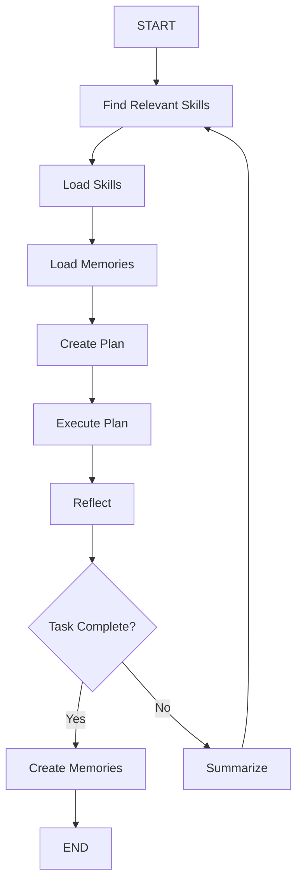

# Basic Skillbot Agent

## Architecture

The agent follows a loop modeled as a LangGraph `StateGraph`. The A2A protocol handles external communication, while skills provide capabilities.




## Key Design Decisions

- **LangGraph `StateGraph`** models the agent loop; each box in the diagram is a graph node
- **AsyncSqliteSaver** from `langgraph-checkpoint-sqlite` provides persistent state per conversation thread
- **A2A SDK** (`a2a-sdk`) provides the server (via `A2AFastAPIApplication`) and defines the `Task` model for communication
- **Skills** follow the [agentskills.io](https://agentskills.io) format: folders with `SKILL.md` files; discovered at startup by scanning configured directories, metadata parsed from YAML frontmatter
- **LangChain OpenAI** (`langchain-openai`) for the LLM provider (extensible to others later)
- **Click** for the CLI framework

## Folder Structure (final)

```
skillbot/
  framework/
    __init__.py
    agent.py          # Abstract AgentFramework class + LangGraph state/graph builder
    state.py          # AgentState TypedDict for LangGraph
  agents/
    __init__.py
    supervisor.py     # Supervisor agent (instance of the framework)
    prompts/
      find-skills.prompt.md
      plan.prompt.md
      reflect.prompt.md
      create-memories.prompt.md
      summarize.prompt.md
  cli/
    __init__.py
    cli.py            # Click CLI: init, start, chat
  tools/
    __init__.py
  skills/
    __init__.py
    loader.py         # Skill discovery, parsing SKILL.md frontmatter, loading scripts as tools
  config/
    __init__.py
    config.py         # Config loading (skillbot.config.json, agent-config.json)
  memory/
    __init__.py
    memory.py         # Read/write user memories (markdown files)
  server/
    __init__.py
    a2a_server.py     # A2A server setup using A2AFastAPIApplication + AgentExecutor
  __init__.py
tests/
  test_hello.py       # Existing (keep)
  ...                 # New tests added per module
```

## Dependencies to Add

- `langgraph` - Agent graph framework
- `langgraph-checkpoint-sqlite` - SQLite checkpointer
- `langchain-openai` - OpenAI LLM provider
- `langchain-core` - Core LangChain abstractions (messages, tools)
- `a2a-sdk` - A2A protocol server and client
- `click` - CLI framework
- `pyyaml` - Parse SKILL.md YAML frontmatter
- `python-frontmatter` - Parse markdown frontmatter cleanly
- `uvicorn` - ASGI server for A2A

## Implementation Details

### 1. Config Module (`skillbot/config/config.py`)

- `SkillbotConfig` dataclass: parses `skillbot.config.json` (services, model-providers)
- `AgentConfig` dataclass: parses `agent-config.json` (model, skill-discovery, prompts, tools, skills)
- Default config location: `~/.skillbot/skillbot.config.json`
- Config loading resolves relative paths in `agent-config.json` relative to the config file's directory

### 2. Skills Module (`skillbot/skills/loader.py`)

- `SkillMetadata` dataclass: `name`, `description`, `path` (parsed from SKILL.md frontmatter)
- `discover_skills(directories: list[Path]) -> list[SkillMetadata]`: scans directories for folders containing `SKILL.md`, parses only YAML frontmatter
- `load_skill(skill: SkillMetadata) -> str`: reads full `SKILL.md` content
- `load_skill_scripts(skill: SkillMetadata) -> list[Tool]`: loads scripts from the skill's `scripts/` directory and wraps them as LangChain `Tool` objects
- Skill discovery method configurable: `"llm"` (default) sends skill names+descriptions to LLM and asks which are relevant

### 3. Memory Module (`skillbot/memory/memory.py`)

- `load_memories(user_id: str, workspace_path: Path) -> str`: reads `memory-<user-id>.md` from the user workspace
- `save_memories(user_id: str, workspace_path: Path, content: str) -> None`: writes/updates the memory file
- Memories stored at `<skill-bot-root-dir>/users/<user-id>/memory-<user-id>.md`

### 4. Agent Framework (`skillbot/framework/agent.py`)

This is the core abstraction -- a reusable agent framework.

**State** (`skillbot/framework/state.py`):

```python
class AgentState(TypedDict):
    messages: Annotated[list[AnyMessage], add_messages]
    task_description: str
    user_id: str
    available_skills: list[dict]   # skill metadata
    loaded_skills: list[str]       # skill names currently loaded
    plan: str
    reflection: str
    task_complete: bool
    memories: str
    summary: str
```

**AgentFramework** class:

- `__init__(config: AgentConfig, skillbot_config: SkillbotConfig)` -- loads config, initializes LLM, discovers skills
- `build_graph() -> CompiledStateGraph` -- constructs the LangGraph StateGraph with nodes:
  - `find_relevant_skills` -- LLM call with all skill names/descriptions; returns which skills to load
  - `load_skills` -- reads full SKILL.md for selected skills, loads scripts as tools, rebinds tools to LLM
  - `load_memories` -- reads user memory file
  - `create_plan` -- LLM call with `plan.prompt.md`, skills in context, tools bound
  - `execute_plan` -- LLM tool-calling loop (standard ReAct)
  - `reflect` -- LLM call with `reflect.prompt.md` and message history; sets `task_complete`
  - `should_continue` -- conditional edge: if `task_complete` go to `create_memories`, else `summarize`
  - `create_memories` -- LLM call with `create-memories.prompt.md`; saves memories to file
  - `summarize` -- LLM call with `summarize.prompt.md`; compresses message history
- Compiled with `AsyncSqliteSaver` checkpointer

### 5. Supervisor Agent (`skillbot/agents/supervisor.py`)

- The default agent instance; instantiates `AgentFramework` with the supervisor's `agent-config.json`
- Contains the `SupervisorExecutor(AgentExecutor)` class implementing the A2A `execute()` and `cancel()` methods
- `execute()` maps the incoming A2A `Message` to the LangGraph state and invokes the graph

### 6. A2A Server (`skillbot/server/a2a_server.py`)

- `create_a2a_app(agent_name, executor, port) -> A2AFastAPIApplication`: configures the A2A server
- Sets up `AgentCard` with the supervisor's capabilities
- Uses `DefaultRequestHandler`, `InMemoryTaskStore` (or later `DatabaseTaskStore`), `InMemoryQueueManager`
- Runs via `uvicorn`

### 7. Default Prompts (`skillbot/agents/prompts/`)

Five markdown prompt files:

- `**find-skills.prompt.md`**: System prompt instructing the LLM to select relevant skills from a provided list given a task description
- `**plan.prompt.md`**: System prompt for creating an execution plan using loaded skills and available tools
- `**reflect.prompt.md**`: System prompt for reflecting on execution results, deciding if the task is complete
- `**create-memories.prompt.md**`: System prompt for extracting key learnings/preferences to persist as user memories
- `**summarize.prompt.md**`: System prompt for summarizing conversation history to reduce context window size

### 8. CLI (`skillbot/cli/cli.py`)

Using Click:

- `**skillbot init [--root-dir PATH]**`:
  - Creates `<root-dir>/skillbot.config.json` (default: `~/.skillbot/`)
  - Creates `<root-dir>/supervisor/agent-config.json` with defaults
  - Creates default prompt files in `<root-dir>/supervisor/`
  - Interactive: asks for model provider, API key, base URL
- `**skillbot start**`:
  - Reads `skillbot.config.json`
  - Starts A2A servers for each configured agent service
  - Prints URLs/ports for each service
- `**skillbot chat --user-id USER_ID**`:
  - Creates user workspace at `<root-dir>/users/<user-id>/`
  - Opens interactive text-based chat loop
  - Sends messages to the supervisor's A2A server using the A2A client SDK
  - Displays streamed responses

Update entry point in `pyproject.toml`:

```toml
[project.scripts]
skillbot = "skillbot.cli.cli:cli"
```

### 9. Update Existing Files

- `**skillbot/__init__.py**`: Update to export the new modules, remove hello world
- `**pyproject.toml**`: Add runtime dependencies, update scripts entry point
- `**README.md**` and `**docs/README.md**`: Update documentation
- Remove `skillbot/hello.py` and update `tests/test_hello.py` -> new tests

